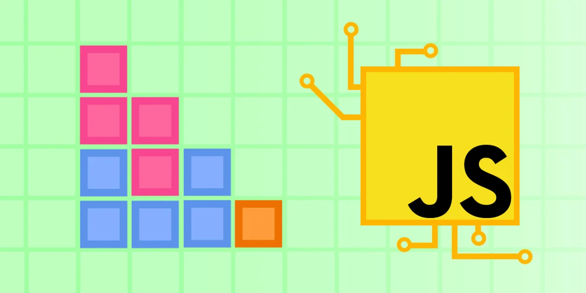

# Project: Build Tetris with modern JavaScript
Periodically I engage in projects to practice my skills, build my skills, so what I know, and create small project demos for potential employers and clients. I was interested in a JavaScript project, so I Googled for a project to create Tetris. I found a "tutorial" from [Educative](https://www.educative.io/) for [building Tetris with modern JavaScript](https://www.educative.io/blog/javascript-tutorial-build-tetris).

I initially anticipated that in this tutorial they solve the problem step by step and allow one to type along if one wished, the equivalent of those computer programming magazines from the 1980s which had programs one could type into one's computer, analogous to old paint-by-number paint kits where one created a painting by painting in the numbered shapes inside an outlined picture. Those kinds of tutorials can be instructive but they don't allow one to demonstrate one's own abilities since from start to finish the problem is solved for you.

Instead the [JavaScript tutorial: Build Tetris with modern JavaScript](https://www.educative.io/blog/javascript-tutorial-build-tetris) by [Educative](https://www.educative.io/) gives one a start, some hints, and a gentle push. One is given a starting point, some hints, and then encouraged to code a solution one's self.

While that provides less instruction were one to need instruction, it definitely gives one the opportunity to demonstrate one's own abilities since it doesn't provide a finished solution, just enough to get started.

I often accumulate many links to potential projects to work on. This one has been sitting waiting for me to attempt it for several years. I started this project on the evening of May 10th, 2023 and have been working on it intermittently since then. I have made substantial progress towards a completed solution.

The work presented is my own.

I have started this project and made substantial progress towards a solution, but have not yet completed it.

Below is an except from the start of the [JavaScript tutorial: Build Tetris with modern JavaScript](https://www.educative.io/blog/javascript-tutorial-build-tetris) by [Educative](https://www.educative.io/):

# JavaScript tutorial: Build Tetris with modern JavaScript
**Link:** [JavaScript tutorial: Build Tetris with modern JavaScript](https://www.educative.io/blog/javascript-tutorial-build-tetris)

From [JavaScript tutorial: Build Tetris with modern JavaScript](https://www.educative.io/blog/javascript-tutorial-build-tetris) by [educative](https://www.educative.io/):

> Learning a new programming language is difficult and not everyone learns the same way. For many, hands-on exploration on a project or interactive tutorial is the key to lasting learning.
> 
> Especially for intuitive languages like JavaScript, building projects helps to provide context for how and why to use fundamental concepts in different applications. It also helps build your resume because you can show recruiters a collection of awesome projects to demonstrate your drive and developer skills.
> 
