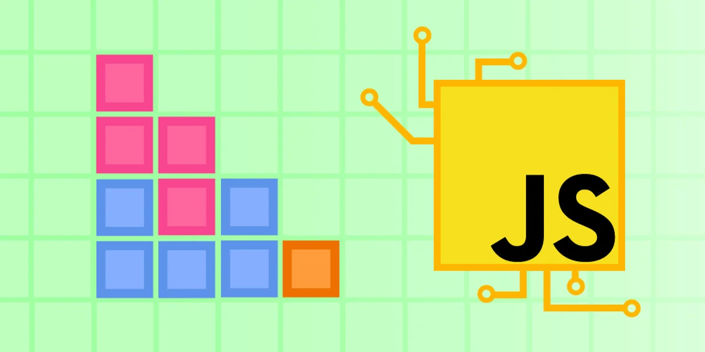

# JavaScript tutorial: Build Tetris with modern JavaScript
**Link:** [JavaScript tutorial: Build Tetris with modern JavaScript](https://www.educative.io/blog/javascript-tutorial-build-tetris)

From [JavaScript tutorial: Build Tetris with modern JavaScript](https://www.educative.io/blog/javascript-tutorial-build-tetris) by [educative](https://www.educative.io/):

> Learning a new programming language is difficult and not everyone learns the same way. For many, hands-on exploration on a project or interactive tutorial is the key to lasting learning.
> 
> Especially for intuitive languages like JavaScript, building projects helps to provide context for how and why to use fundamental concepts in different applications. It also helps build your resume because you can show recruiters a collection of awesome projects to demonstrate your drive and developer skills.
> 
